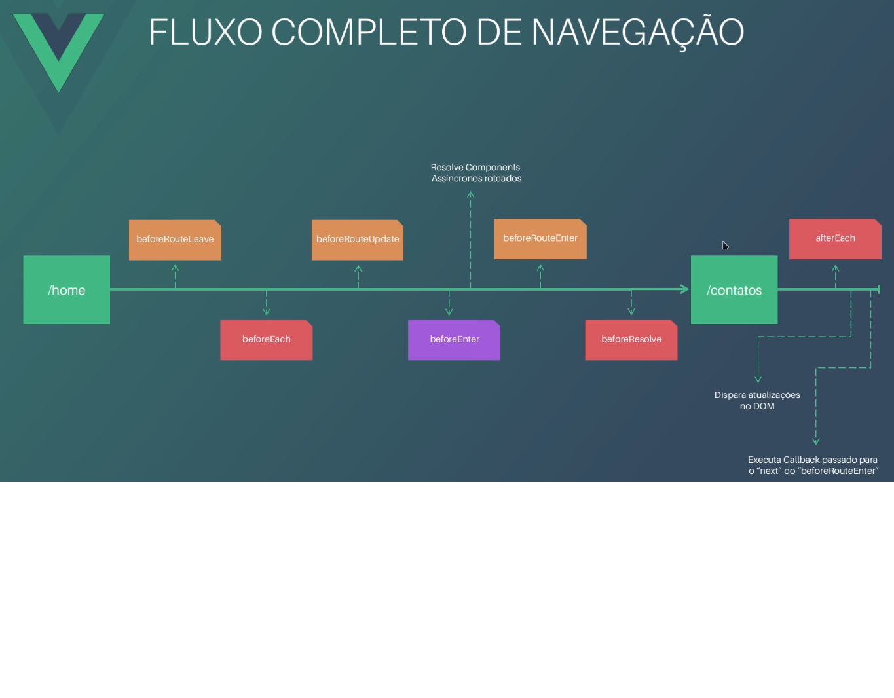

These hints are wrote to guide the developer in the vue-router many ways to do some tasks.

Navigation Guards hints:

Navigation process in vue-router:

1 - beforeRouteUpdate instead of watchers to update data values when switching between routes.
Explanation: when you have a long list of data to be updated when changing routes in the app, you will need to create
a lot of watchers as many data as you have. With beforeRouteUpdate guard you can do it in one single function.
E.g.
watch: {
name(current, old) {
this.name = current;
},
age(current, old) {
this.name = curent;
},
...etc
}
beforeRouteUpdate(to) {
this.name = to.name;
this.age = to.age;
...etc = to.etc
}

Params and route hints:

1 - Param data type validation in vue-router route settings JS file.

Instead of using :paramName you will need to use :paramName(treatment)
Using regex in route path to handle params data validation(number): path: '/route/:param(\\d+)'
E.g. To deal only with text: path: '/route/:param([A-z]+)'

2 - Optional and mandatory route params.

Mandatory with one or more params(return error if do not pass params): // alias: ":id(\\d+)/change/:oneOrPlus+", ->
E.g. /1/change/oneparam/twoparam => oneOrPlus: 'oneparam/twoparam'

Optional zero or more params(return undefined if do not pass params): // alias: ":id(\\d+)/change/:zeroOrPlus\*", ->
E.g. /1/change/one => zeroOrPlus : 'one'

Optional single param: // alias: ":id(\\d+)/change/:optional?", -> E.g. /1/change/hello => optional : 'hello'
